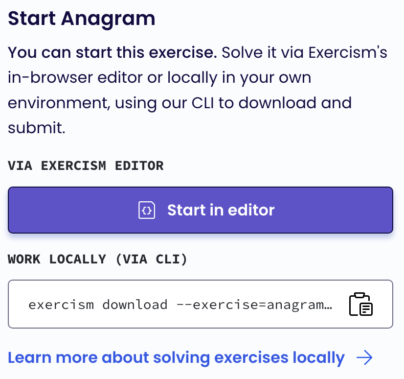

# Learning Rust as a embedded C programmer

# Intro

개발자로서 정체성 등등의 고민과 걱정의 시기가 나에게 오고 말았다.
벌써 이렇게 나이가 들었다니 놀랍지만, 당연히 새로운 시작을 해야겠지.
unlearn 하고 learn 하는 과정이 쉽지 않겠지만, 시도할 수 밖에 나는 여전히 좋은 개발자가 되고 싶으니까

Season 2 언어부터 기술까지 새로움으로 채워보고 싶다.
C 의 장점을 가지면서, 다양한 응용이 가능한 언어를 찾고 있는데, Rust가 그 종착역인 듯
활용분야가 넓고 배우기 어려워서?! Rust 개발자가 되기로 결정

이제 조그만 device들과 씨름하는 개발을 넘어 에서 넓고 넓은 인터넷 세계의 개발로 나아가 보자.
왠지, 바깥 세상에 대한 두려움이... —; 그래도 가자.

조금 배워 보니C 보다 훨씬 어렵고, Python 은 일상 언어로 느껴질 지경...
근데, OOP 아니네, 그건 몰랐는데, 잘 됬어 그래 난 상속이 싫었어...

# Good Things for C Programmers

1 stop package & build system

memory safe coding

compiler driven development

dev community

documentations

modern programming concepts

wide range from embedded to web

# Challenges

Ownership

reference

trait

enum

match

Option / Result handling

lifetime specifier

functional programming

# Learning

Step 1 을 끝내고(80% 이상)

Step 2/3 을 동시에 진행

### Step 1 : Rust fundamental (systax & idioms)

Rust를 배웁시다. (Kor/Eng) by \***\*David MacLeod\*\***
이 분은 mutli-lingual인데, programming language는 처음 배운 언어가 rust 이다.
한국말을 그냥 잘 하는 수준이 아니기 때문에, 외국인이지만 한국어로 강의하는 것이 전혀 문제 없다
오히려, computer field term으로 쓰이는 용어들은 영어 자체가 잘 이해 안 될 때가 있는데
그런 부분이 설명을 해주기 때문에 더 강점이 있다.
본인이 온라인에 공개한 책을 강의로 만들었기 때문에 교재와 강의가 모두 available

영상보고 교재로 복습

[https://dhghomon.github.io/easy_rust/](https://dhghomon.github.io/easy_rust/)

[Easy Rust Korean / 한국어판](https://www.notion.so/d0f614ab40194dfcac980bc6632d4eaf)

### Step 2 : Coding Practice

muscle memory building(acturally it doensnt have memory though)

어느 정도 코딩할 수 있을 정도 지식이 생기면, 몸으로 익혀야 함,
코딩 하면서 부족한 부분을 명확히 인지하게 되고 그 부분을 관련 자료 찾아 공부

Rustlings : 조금 쉬운 편

[https://github.com/rust-lang/rustlings](https://github.com/rust-lang/rustlings)

**Exercism** : Online learning how to coding platform (코딩 인터뷰용이라기 보단, 교육적 목적 for free)

[https://exercism.org/tracks/rust](https://exercism.org/tracks/rust)

Solve coding exercises and get mentored to gain true fluency in your chosen programming languages.

WORK LOCALLY 로 VS Code 등 IDE를 도움을 받아 코딩하는 것이 좋고,
Test Case 작성법을 배워 볼 수 있다.



갈 길이 아직 많이 남았다


### Step 3 : Commandline in Rust

### Step 4 : Zero 2 Production in RUST

책 선택 이유

1. Learning by doing
   실습을 해야 손에 익고, 성취가 있는데, 적합한 책을 찾던 중 backend ACTIX 에 관심이 생겼고,
   이 책이 ACTIX를 다루고 있다. (몇 가지 project base 책들이 있음),
2. e-book PDF version,
   최근에 완료 되었고, 계속 update 될 수 있다. rust / actix upate에 대응
   작가가 2년에 걸쳐서 썼고, 내용을 아주 성실히 쓴 것 같다.
   책 목적 중에 하나가 새로오는 팀원들을 위해 썼다고 한다.
   그래서, 초보 베이스 책은 아니지만, 세심하게 배려했다고 서문과 리뷰에 언급되어 있어 안심하고 구매
3. English Challenge 영어 읽기의 훈련
   영어로 책을 읽는 다는 것이 쉬운 것은 아니지만, 이건 꼭 극복해야 하고, 아주 느리게 나아지고 있다.
   프로그래머에게 영어는 프로그래밍 언어 만큼 중요하다.
   피할 수 있으면 피해 오면서 더 손해가 되는 것 같다. 이제 피했다.


좀 어렵게 느껴지지만, 이미 시작한 이상 끝은 봐야지.


### 다 읽은 후에는

만들자 무언가 (생각나는 대로 적어 보자)
공공 Data 를 활용해서 API server 를 만들기.

more versatile :

- Linux Kernel Module (Rpi4 Project)

- WASM 해보기

- ...

ZERO2PRODUCTION 읽기

first example

```rust
use actix_web::{web, App, HttpRequest, HttpServer, Responder};

async fn greet(req: HttpRequest) -> impl Responder {
    let name = req
        .match_info()
        .get("name")
        .unwrap_or("World");
    format!("Hello {}!", &name)
}

#[tokio::main]
async fn main() -> std::io::Result<()> {
    HttpServer::new(|| {
        App::new()
            .route("/", web::get().to(greet))
            .route("/{name}", web::get().to(greet))
    })
    .bind("127.0.0.1:8000")?
    .run()
    .await
}

#![feature(prelude_import)]
#[prelude_import]
use std::prelude::rust_2021::*;
#[macro_use]
extern crate std;
use actix_web::{web, App, HttpRequest, HttpServer, Responder};
async fn greet(req: HttpRequest) -> impl Responder {
    let name = req.match_info().get("name").unwrap_or("World");
    {
        let res = ::alloc::fmt::format(::core::fmt::Arguments::new_v1(
            &["Hello ", "!"],
            &[::core::fmt::ArgumentV1::new_display(&&name)],
        ));
        res
    }
}

fn main() -> std::io::Result<()> {
    let body = **async** {
        HttpServer::new(|| {
            App::new()
                .route("/", web::get().to(greet))
                .route("/{name}", web::get().to(greet))
        })
        .bind("127.0.0.1:8000")?
        .run()
        .await
    };
    #[allow(clippy::expect_used)]
    tokio::runtime::Builder::new_multi_thread()
        .enable_all()
        .build()
        .expect("Failed building the Runtime")
        .block_on(body)
}
```

### Step 3 : My very first realworld RUST Project

useful, big idea, start small

# References


