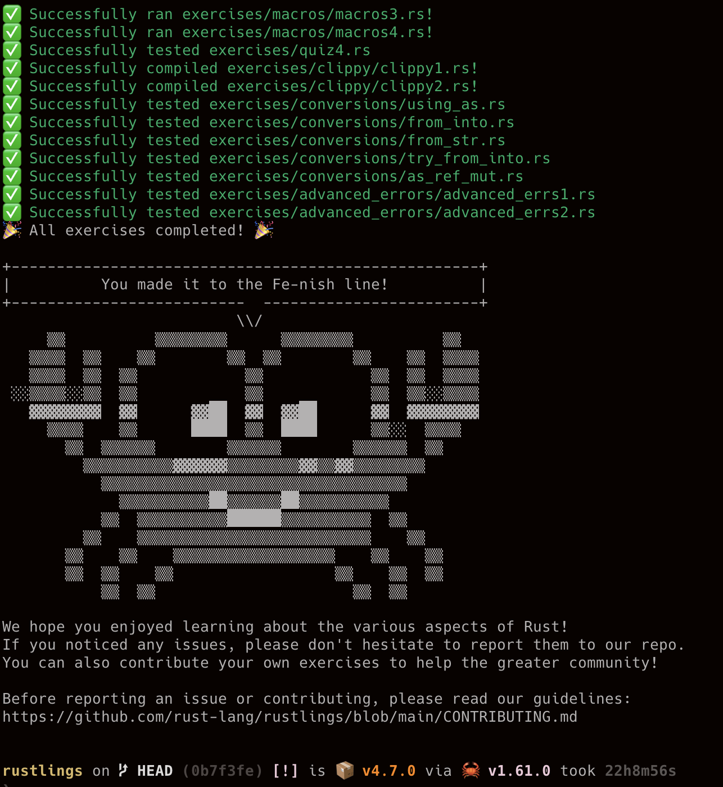
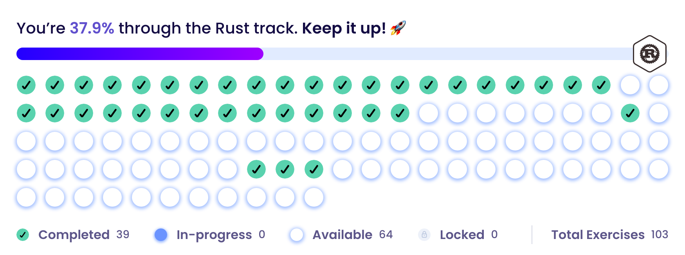

# Learning Rust as a embedded C programmer  
  - [Intro](#intro)
    - [Good reasons for C Programmers](#good-reasons-for-c-programmers)
    - [Challenges](#challenges)
  - [Learning](#learning)
    - [Step 1 : Rust fundamental (syntax & idioms)](#step-1--rust-fundamental-syntax--idioms)
    - [Step 2 : Coding Practice](#step-2--coding-practice)
    - [Step 3 : Rust books written in English](#step-3--rust-books-written-in-english)
      - [Step 3-1 : Command-Line Rust](#step-3-1--command-line-rust)
      - [Step 3-2 : Zero 2 Production in RUST](#step-3-2--zero-2-production-in-rust)
    - [Step 4 : Learning by doing some projects](#step-4--learning-by-doing-some-projects)
  - [My own q/a](#my-own-qa)
  - [References](#references)
## Intro
> My journey to be a Rustacean 🦀    
> 
> 
> 

지금껏, 일하며 살아왔던 시간들을 회고해 보니 꽤 오랜 동안 나름 고군분투 했지만, 내가 원하는 수준의 개발자가 된 것은 아니었다.  
내가 경험했던 embedded system 에서는 system building(bring-up) 과 software 개발 이 5:5 정도 였던 것 같다.  
Embedded System Building은 꽤 익숙한 수준에 이르렀으나 Software 개발은 만족할 수준이 아니다.  
내가 잘 하고 싶었던 것은 소프트웨어 개발 그 자체 였던 것 같고, 앞으로는 소프트웨어 개발에 몰입하고 싶다. 

이왕 손에 익은 것만 붙잡고 있을 것이 아니므로, 사용해본적이 없는 새로운 언어를 사용하고 싶었다.  
C 의 장점을 가지면서, 다양한 응용이 가능한 언어를 찾고 있는데, *Rust*가 그 Solution 인 듯하다   
익숙한 것에서 벗어나는 것이 다소 두렵지만, 시도해보는 것이 후회없을 것 같다.  
 
### Good reasons for C Programmers

- one-stop package & build system
- test built-in support
- memory safe coding
- compiler driven development
- dev community
- documentations
- modern programming concepts
- wide range from embedded to web
- easy TDD

### Challenges

- Ownership
- reference
- trait
- enum
- match
- Option / Result handling
- lifetime specifier
- functional programming
- smart pointer  
  Interior mutability
- closure

## Learning
### Step 1 : Rust fundamental (syntax & idioms)
- [x] The book 한글 번역 버젼  (https://rinthel.github.io/rust-lang-book-ko/)  
  - [x] 읽기 : 챕터별로 가독성이 많이 다르다. 이 책 자체가 초심자를 위한 책은 아니고 어려움 (22.05.19)   
  - [x] Cheat sheet
        https://github.com/donbright/rust-lang-cheat-sheet         
        
- [ ] Easy Rust : Rust를 배웁시다. (Kor/Eng) by David MacLeod  
한국말을 그냥 잘 하는 수준이 아니기 때문에, 외국인이지만 한국어로 강의하는 것이 전혀 문제 없다.  
[Easy Rust Korean / 한국어판 강의](https://www.youtube.com/playlist?list=PLfllocyHVgsSJf1zO6k6o3SX2mbZjAqYE)  
[Easy Rust Book](https://dhghomon.github.io/easy_rust/)  
  정렬된 강의 비디오 리스트 [TOC of Easy Rust](/toc_easyrust_playlist)

### Step 2 : Coding Practice
muscle memory building(acturally it doensnt have memory though)  
어느 정도 코딩할 수 있을 정도 지식이 생기면, 코딩 하면서 부족한 부분을 명확히 인지하게 되고 그 부분을 관련 자료 찾아 공부

- [ ] Coding Quiz(Leetcode 류의 문제) : 연습량 늘리기
  [/practice/training/](/practice/training/src)
  

- [X] Rustlings : 조금 쉬운 편 (22.05.20)
[https://github.com/rust-lang/rustlings](https://github.com/rust-lang/rustlings)

- [ ] **Exercism** : Online learning how to coding platform (코딩 인터뷰용이라기 보단, 교육적 목적 for free)  
[https://exercism.org/tracks/rust](https://exercism.org/tracks/rust)  
Solve coding exercises and get mentored to gain true fluency in your chosen programming languages.  
Web에서 문제를 풀어볼 수 있지만, WORK LOCALLY 방식으로 IDE의 도움받아서 코딩하는 것이 좋고,
Test Case를 통해 힌트를 얻고 test 작성법을 배울 수 있다.

  

### Step 3 : Rust books written in English
   원서를 end to end로 읽으면서 공부하는 것이 시간과 노력이 더 들겠지만, 우리말 자료가 별로 없기 때문에 선택의 여지가 없다.  
   영어가 프로그래밍 언어 이상으로 중요하다는 것을 때때로 까먹고 다시 깨닫고 그런다.

#### Step 3-1 : Command-Line Rust
- [ ] https://www.oreilly.com/library/view/command-line-rust/9781098109424/

#### Step 3-2 : Zero 2 Production in RUST
- [ ] [Auth Web Microservice with rust using Actix-Web 4.0](https://gill.net.in/posts/auth-microservice-rust-actix-web1.0-diesel-complete-tutorial/)
- [ ] [Book : Zero To Production](https://www.zero2prod.com/index.html?country=Korea&discount_code=SEA60)  
* backend에 관심이 생겼고 적합한 책을 찾던 중 이 책이 Project-base로 디자인 되어있었다. 
* 최근에 Update 되었고, 책을 쓴 이유 중 하나가 새로 오는 팀원들을 위해 썼다고 한다.
  그래서, 초보용 책은 아니지만, 세심하게 배려했다고 서문과 리뷰에 언급되어 있어 안심하고 구매(했지만, 어렵다.)

    
   

### Step 4 : Learning by doing some projects
useful, big idea, start small
만들자 무언가 (생각나는 대로 적어 보고, 점차 구체화 할 것)
- Linux Kernel Module
   - C -> Rust
- CLI app
   - Stock Trading SDK + Trader App (한국투자증권 KIS API)  
     https://github.com/goodsw4all/KIS_OpenAPI_in_Rust
- solana Dapp
- WASM
- 공공 Data API 를 활용해서 sth?

## My own q/a

## References

